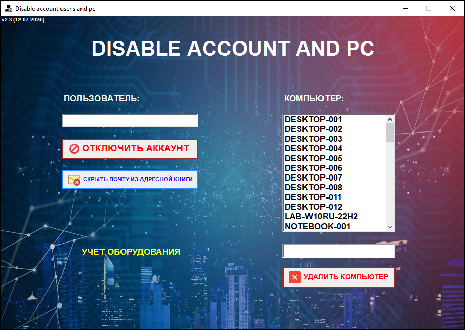

# Disable-AD-Account
Данный скрипт реализует полнофункциональное графическое приложение (GUI) на PowerShell, 
предназначенное для автоматизации процесса деактивации пользователей и удаления компьютеров из корпоративной инфраструктуры на базе Active Directory, MEM (Microsoft Endpoint Manager / SCCM) и DNS.
Скрипт автоматически проверяет запуск от имени администратора и при необходимости перезапускает себя с повышенными привилегиями.  

Основные функции для пользователей:
 - Управление учетными записями пользователей AD
 - Получение списка пользователей из заданного OU;
 - Очистка атрибутов пользователя (компания, должность, отдел, руководитель);
 - Добавление пользователя в группу Domain Guests;
 - Изменение основной группы пользователя (PrimaryGroupID → Domain Guests);
 - Удаление всех групп, кроме основной;
 - Отключение учетной записи;
 - Перемещение учетной записи в другую OU;
 - Скрытие почтового ящика пользователя в адресных списках Exchange.

Основные функции для устройств:
 - Управление учетными записями компьютеров;
 - Получение списка компьютеров из определенного OU;
 - Удаление компьютеров из Active Directory;
 - Удаление DNS-записей для компьютеров;
 - Удаление устройств из MEM (SCCM);
 - Запуск консоли System Center Operations Manager (SCOM);
 - Обновление списка компьютеров в интерфейсе.

## Скриншоты

### Главное окно  

### Отключение пользователя
Для отключения учетной записи пользователя необходимо ввести его ФИО и нажать кнопку "Отключить пользователя". После этого появится окно подтверждения. 
После подтверждения будут выполнены все необходимые действия, а результат отобразится в виде уведомления.
